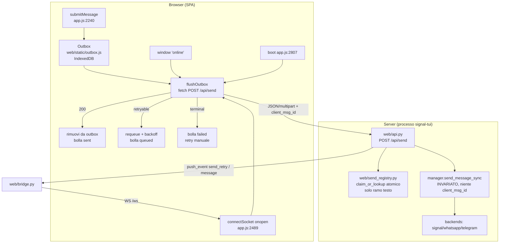
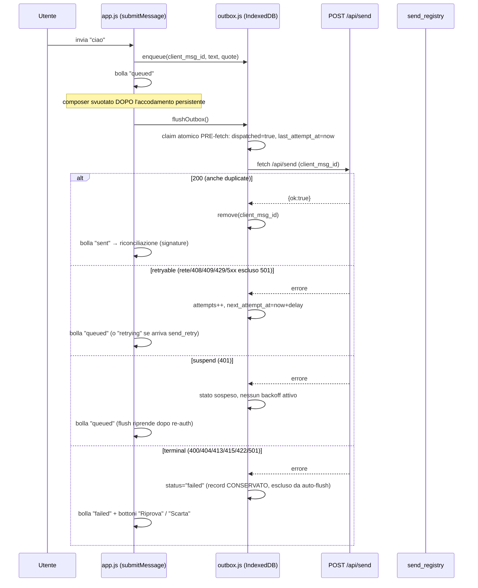

# DESIGN — Retry dei messaggi Web UI che sopravvive alla disconnessione

**Stato:** APPROVATO / CONGELATO (2026-09-28). v1 pronta per l'implementazione. Decisioni D2–D8 congelate (§14); v2 documentata come follow-up, non implementata.
**Branch:** master.
**Obiettivo:** garantire che i messaggi inviati dalla Web UI non vadano persi
quando il browser perde la connessione al server (offline, tunnel Cloudflare,
handover tra macchine, server irraggiungibile), e che l'invio non produca
duplicati quando la richiesta viene ritentata. Solo design: nessuna
implementazione.

> **Decisione di mediazione adottata:** split in **v1** (outbox client-side +
> registry di idempotenza in-memory, **senza** colonna DB né threading
> multi-backend) e **v2** (colonna DB `client_msg_id` + threading + riconciliazione
> per identità + send ledger). v1 è lo scope di questo lavoro; v2 è documentato
> come follow-up, non implementato ora.

---

## 0. Revisioni e storico

### 0.1 Revisione v2 post red team (respinso → approvato con riserve)

La v1 mescolava outbox client-side e dedup su colonna DB. Il red team la respinse
per blast radius eccessivo e obiezioni B1–B7. La v2 adottò lo split v1/v2 e
risolse/rinviò B1–B7 (tabella §0.3).

### 0.2 Revisione v3 post red team v2 — riserve N1–N8 risolte

Il red team ha dato **APPROVATO CON RISERVE** alla v2, con 4 fix bloccanti
(N1–N4) e 4 di specifica (N5–N8). Questa revisione li risolve puntualmente:

| Id | Riserva | Esito in questa revisione |
|---|---|---|
| N1 | due 409 con semantica opposta; client li tratta entrambi retryable | **RISOLTO** (§7.2, §8.2): `409` = inflight retryable, `422` = conflict terminal; tabella esplicita `classifyHttpFailure` a 3 esiti |
| N2 | `release` sul ramo 409-inflight può liberare il claim altrui | **RISOLTO** (§8.2): API atomica `claim_or_lookup` con token di ownership; `release`/`mark_sent` solo se token corrisponde; 409-inflight non muta il registry; test di concorrenza |
| N3 | TTL registry (10 min) ≪ retention outbox (7 g) → duplicato silenzioso stesso processo | **RISOLTO** (§7.7): finestra di auto-resend client allineata al TTL; oltre → stato "da confermare" con retry manuale; §3.1/§5.3 non promettono più F3 incondizionato |
| N4 | piano test B5 sotto-scoped | **RISOLTO** (§9.2): elenco completo dei test che si rompono + fallback "outbox assente" |
| N5 | `known_message_ids` al boot include l'eco del già-inviato → doppia bolla | **RISOLTO** (§9.1): record ripristinati con `known_message_ids = []` + pairing vincolato a `riga.timestamp >= item.timestamp`; `timestamp`/`optimistic_id` in schema |
| N6 | fonte payload quote errata (optimistic ≠ wire) | **RISOLTO** (§7.1.1): helper unico `buildSendPayload(...)`; fingerprint sul payload normalizzato |
| N7 | registry sugli allegati → drop silenzioso del file | **RISOLTO** (§8.2.3): registry solo ramo testo; allegati legacy non deduplicati |
| N8 | minori (path, D8, 401, persist(), testabilità, LRU, quote pruned) | **RISOLTO** (§7.2, §8.2, §9.3, §11, §12, §13) |

### 0.2.1 Revisione v3.1 — falle interne R-A–R-D risolte

Il red team ha confermato N1–N8 ma ha trovato 3 falle (R-A alta, R-B/R-C medie)
e micro-incoerenze (R-D) che bloccavano il freeze dei contratti di dedup:

| Id | Falla | Esito in questa revisione |
|---|---|---|
| R-A (ALTA) | LRU evince `sent` prima del TTL → rompe la dedup entro la finestra | **RISOLTO** (§8.2): eviction solo `sent` **oltre** il TTL; mai evincere una `sent` giovane; cap generoso + pruning periodico; test "capacity pressure" |
| R-B (MEDIA) | `attempts == 0 → sempre auto-flush` reintroduce auto-resend incondizionato (tab ucciso tra send riuscito e resolve) | **RISOLTO** (§7.7): flag `dispatched` + `last_attempt_at` persistiti **prima** della fetch; finestra temporale applicata a ogni record con tentativo partito |
| R-C (MEDIA) | contraddizione fallback senza IndexedDB (in-memory vs legacy sync) | **RISOLTO** (§6.2, §11, §13): (1) modulo non caricato → legacy sync; (2) `indexedDB` assente ma modulo caricato → outbox in-memory asincrono, stesso contratto |
| R-D (BASSA) | micro-incoerenze schema/§ | **RISOLTO** (§7.1, §7.3, §7.6, §9.1): nomi allineati, `next_attempt_at` aggiunto, `failed` conservato (non rimosso), `isMedia` aggiunto |

### 0.3 Tabella di risoluzione B1–B7 (dalla v2)

| Id | Obiezione | Esito |
|---|---|---|
| B1 | dedup non scoped → perdita silenziosa | **RISOLTO in v1** (§8.2): chiave `(protocol, contact, client_msg_id)` + verifica fingerprint |
| B2 | dedup DB non atomico | **RINVIATO a v2** (§10.1): UNIQUE partial index + `ON CONFLICT DO NOTHING` |
| B3 | `inflight` non ripulito su 502; 409 non classificato; 401 contraddittorio | **RISOLTO in v1** (§8.2.2, §7.2, §11) |
| B4 | threading `client_msg_id` rompe mirror WA/TG | **RINVIATO a v2** (§10.2) |
| B5 | claim falsa "nessuna rottura test" | **RISOLTO in v1** (§9.2) |
| B6 | handover cross-macchina → duplicato reale | **FUORI SCOPE, sign-off ACCETTATO** (§12 R5) |
| B7 | race echo: mirror prima di `client_msg_id` | **RINVIATO a v2** (§10.3) |

### 0.4 Congelamento v1 (2026-09-28)

L'utente ha risposto alle domande aperte. v1 è **APPROVATA/CONGELATA**: le
decisioni D2–D8 sono definitive (§14) e non sono più oggetto di review. v2 resta
documentata come follow-up (§10), non implementata. Il design è pronto per
l'implementazione secondo il piano §13.

---

## 1. Contesto e problema

La Web UI (FastAPI `web/api.py` + SPA vanilla `web/static/app.js`) ha già un
retry **server-side e sincrono** per il solo testo: commit `6b7e363` (PR #227),
`web/retry.py` (logica pura `classify_send_error` / `compute_delay`,
`SEND_RETRY_MAX_ATTEMPTS=3`, base 1 s, jitter 0–1 s) + ramo testo in
`web/api.py` (loop 3 tentativi dentro `POST /api/send`, backoff, evento WS
`send_retry`).

Questo retry copre **solo** i guasti transitori *mentre la richiesta HTTP è in
corso*. Non copre il caso centrale sollevato dall'utente:

> *"il problema anche per solo testo è che in caso di disconnessione non c'è retry"*

Quando il browser perde la connessione (o la richiesta `fetch` fallisce prima
di raggiungere il server, o il server muore durante la richiesta), il loop
server-side non parte proprio o viene troncato, e:

1. il composer viene **già svuotato** (`app.js:2334`) e gli allegati staged
   **già cancellati** (`app.js:2335`) *prima* della `fetch`;
2. su errore la bolla optimistic viene marcata `failed` (`app.js:2370-2371`)
   senza alcuna via di retry;
3. il messaggio è **perso**.

### 1.1 Vincolo operativo (non teorico)

Il client gira anche in **handover** tra due macchine (desktop + server
Hetzner) ed è raggiungibile via tunnel Cloudflare / da mobile PWA. La
disconnessione browser↔server è uno scenario reale e frequente. Lo stesso
handover rende **non mitigabile** il duplicato cross-macchina: vedi §12 (R5).

---

## 2. Analisi dei failure mode

| # | Failure mode | Sintomo attuale | Coperto oggi? | v1 | v2 |
|---|---|---|---|---|---|
| F1 | Browser offline / server irraggiungibile all'invio | `fetch` rigetta → bolla `failed`, testo perso | ❌ | ✅ outbox | — |
| F2 | Riconnessione (WS `onopen` / `online`) con messaggi in attesa | `onopen` fa solo `loadMessages()` (`app.js:2495`) | ❌ | ✅ flush | — |
| F3 | Richiesta interrotta / risposta 200 persa (stesso processo, **entro la finestra di dedup**) | re-invio duplica | ❌ | ✅ registry in-memory | ✅ + DB |
| F3b | Richiesta interrotta / server **riavviato** (nuovo processo, stessa macchina) | re-invio duplica | ❌ | ⚠️ race residua (registry perso) | ✅ colonna DB |
| F3c | Risposta 200 persa + client offline **oltre la finestra di dedup** | re-invio duplica | ❌ | ⚠️ mitigato da "da confermare" (§7.7) | ⚠️ (send ledger §10.4) |
| F4 | Backend protocollo giù oltre la finestra ~6 s | 502 → bolla `failed` | ❌ | ✅ outbox ritenta | — |
| F5 | `client_msg_id` non usato per dedup | accettato (`api.py:1208-1217`), inutilizzato | ❌ | ✅ registry in-memory (solo testo) | ✅ colonna DB |
| F6 | Messaggio inviato che torna via echo con identità diversa | riconciliazione per signature fragile | ⚠️ euristica | ⚠️ invariata (signature) | ✅ per identità |
| F7 | Reload pagina con messaggi in attesa | nessun outbox persistente | ❌ | ✅ IndexedDB | — |
| F8 | **Handover cross-macchina**: invio riuscito su A, risposta persa, retry su B | DB separati per macchina | ❌ | ❌ **fuori scope (accettato)** | ❌ fuori scope |

### 2.1 Gap di classificazione lato server

`web/retry.py::_classify_signal` tratta i timeout come **terminal**;
`protocols/rpc.py:334-335` cattura ogni eccezione in `{"error": str(e)}` e
`protocols/signal.py:611-612` lo rilancia come `RuntimeError`. Con l'outbox
client-side questo gap perde rilevanza per F1/F2, ma resta per F4: il server
restituirà 502 e tocca al client decidere se ritentare (§7.2). **D7 rimandato**
(§12, R6): rendere retryable il timeout può duplicare un send già consegnato.

---

## 3. Requisiti

### 3.1 Funzionali (v1)

1. **F1**: invio fallito per browser offline/server irraggiungibile → **non
   perso**.
2. **F2**: alla riconnessione i messaggi in attesa vengono **ritentati
   automaticamente**.
3. **F3**: richiesta interrotta/risposta persa → **nessun duplicato *entro la
   finestra di dedup* (§7.7)**. Oltre la finestra la garanzia degrada: il
   record passa a "da confermare" (retry manuale), non si auto-rispedisce.
4. **F4**: backend giù oltre ~6 s → messaggio in coda, ritentato quando torna.
5. **F5**: `client_msg_id` è la chiave di idempotenza (in-memory, **solo ramo
   testo**).
6. **F7**: persistenza dell'outbox su IndexedDB (**CONFERMATA**, D2).
7. **UX**: stati bolla, retry manuale, niente spam/duplicati.

### 3.2 Non-funzionali

- Logica pura testabile separata dall'I/O (come `web/retry.py`); eventi WS come
  contratto; nessuna nuova dipendenza pesante.
- Non rompere i contratti esistenti di `POST /api/send` e `send_retry`; test
  aggiornati in modo esplicito (§9.2).
- Sicurezza/privacy outbox (§11).
- v1 minimale che copre F1/F2.

---

## 4. Stato attuale (verificato sul codice)

- **`apiFetch`** (`app.js:148-167`): `fetch` + Bearer; su `!ok` lancia
  `Error("HTTP <status>")` con `.status`.
- **Invio** (`app.js:2240-2384`): `clientMsgId` (`app.js:2253`), bolle optimistic
  `"sending"`, composer svuotato (`app.js:2334`) e staged cancellato
  (`app.js:2335`) **prima** della `fetch`; su errore `"failed"`
  (`app.js:2370-2371`).
- **Payload wire quote** (`app.js:2340-2350`): per Signal media reply
  `quote_message` è forzato a `""` (riga 2343) — **diverso** dal blocco
  optimistic (`app.js:2256-2277`) che invece salva il display. Fonte di verità
  per il payload è il ramo `2340-2350`, non il blocco bolla.
- **WS reconnect** (`app.js:2469-2496`): `onopen` fa solo `loadMessages()`
  (`app.js:2495`).
- **Eventi WS** (`app.js:2503-2555`): `message`, `send_retry`, `receipt`, ecc.;
  il ramo `send_retry` (`app.js:2538-2554`) aggiorna solo stati
  `"sending"`/`"retrying"` (contratto statico `test_web_send_retry.py:389-392`).
- **`client_msg_id`**: generato (`app.js:2253`), inviato **sia** testo
  (`app.js:2366`) **sia** allegati (`app.js:2356`), normalizzato
  (`api.py:1208-1217`), **non** usato per dedup.
- **Riconciliazione** (`web/static/reconcile.js:159-299`): per signature;
  `known_message_ids` (`app.js:2254`) esclude righe già presenti.
- **Ramo allegati** (`api.py:1347-1397`, `manager.send_attachments_sync`):
  nessun retry, nessun dedup.
- **Persistenza SPA**: `localStorage` solo token/protocollo (`app.js:3-4`);
  nessun outbox, nessun IndexedDB, nessun Web Locks/BroadcastChannel (verificato:
  zero occorrenze in `web/static/`).
- **`_enqueue_sent_message`** (`manager.py:347-395`): l'`except Exception`
  (`manager.py:390-395`) ingoia **anche** un `TypeError` da kwarg sconosciuto →
  un `client_msg_id` propagato in v1 farebbe cadere il mirror. Confermato: né
  `whatsapp.py:1764-1780` né `telegram.py:1247-1263` accettano `client_msg_id`.
- **Schema DB**: dedup `_add_message_to_cache` (`db.py:535-555`) su
  `(protocol, contact_number, text, is_mine, timestamp, msg_id, attachment_id)`;
  unico indice `idx_messages_contact (protocol, contact_number, timestamp)`
  (`db.py:249`), nessun UNIQUE.
- **Nessun rate-limit server** in `web/*.py` (il 429/5xx in `web/retry.py:85,104`
  è solo classificazione di errori WAHA, non un rate limiter).

---

## 5. Opzioni valutate (trade-off)

### 5.1 Dove vive il retry di disconnessione

| Opzione | Esito |
|---|---|
| A — Retry solo server-side (stato attuale) | **Scartata**: muore con la richiesta; non copre F1/F2 |
| B — Retry server-side asincrono (job fuori dalla richiesta) | **Scartata**: il "non inviato" è proprietà del client; viola il vincolo "web writer, non persistenza"; complica echo/ottimismo |
| C — **Outbox client-side** | **SCELTA** |

### 5.2 Persistenza outbox (F7)

| Opzione | Esito |
|---|---|
| A — Solo in-memory | **Scartata come default**: non sopravvive al reload |
| B — `localStorage` (JSON) | **Scartata**: string-only, sync, ~5 MB, non contiene `File`/`Blob` |
| C — **IndexedDB** (structured clone) | **SCELTA**: persiste oltre il reload, accetta `File`/`Blob` |

### 5.3 Idempotenza end-to-end (F3/F5)

| Opzione | Esito |
|---|---|
| A — Nessun dedup (stato attuale) | **Scartata**: F3 duplica |
| B — **Registry in-memory** (v1) | **SCELTA per v1**: dedup nello stesso processo, **entro la finestra di dedup**; minimale |
| C — Colonna DB + threading (v2) | **Rinviata a v2**: blast radius (B4/B7), non necessaria per F1/F2 |

**Motivazione v1 in-memory e limite dichiarato:** F1/F2 (lo scope di questo
lavoro) richiedono solo che il client ritenti e che un re-invio *rapido* nello
stesso processo non duplichi. La garanzia F3 **non è incondizionata**: è valida
entro la finestra di dedup (§7.7). Oltre la finestra, e per cross-riavvio
(F3b) / handover (F8), il duplicato è possibile e dichiarato (§12). SQLite resta
intoccato in v1.

---

## 6. Architettura proposta (v1)

### 6.1 Vista d'insieme



### 6.2 Componenti

| Componente | File (nuovo/modificato) | Responsabilità |
|---|---|---|
| **Outbox store** | **nuovo** `web/static/outbox.js` | store IndexedDB (backend iniettabile); **fallback in-memory asincrono se `indexedDB` assente** (R-C); funzioni pure `classifyHttpFailure`/`computeClientDelay`/`buildSendPayload`; `enqueue`/`flush`/`remove`/`retry`; normalizzazione record |
| **SPA integrate** | `web/static/app.js` | `submitMessage` accoda (non invia subito); trigger flush (`onopen`/`online`/`boot`/timer); stati bolla; bottone retry/scarta; rimozione su riconciliazione; **percorso legacy sync solo se `outbox.js` non è caricato** (R-C) |
| **Registry dedup server** | **nuovo** `web/send_registry.py` | `claim_or_lookup`/`mark_sent`/`release` con token; chiave scoped; eviction solo `sent` scadute (R-A) + TTL; thread-safe |
| **API handler** | `web/api.py` | consulta/aggiorna il registry (solo ramo testo); `finally` di release; **nessuna propagazione di `client_msg_id` ai backend** |
| **CSS stati** | `web/static/style.css` | `.message-status.queued`, `.message-status.confirm` |
| **HTML** | `web/static/index.html` | `<script src="/outbox.js?v=…" defer>` prima di `app.js` |

**Invariante chiave v1:** `client_msg_id` non supera mai il confine
`web/api.py → manager`. Il `manager.send_message_sync` e tutti e 3 i backend
restano **byte-identici** (§B4). Il registry in-memory, **limitato al ramo
testo**, è sufficiente.

---

## 7. Data model e logica client (outbox)

### 7.1 Schema IndexedDB (completo)

```js
// DB "signal-tui-web" v1, object store "outbox", keyPath "id".
{
  id: "out-<client_msg_id>",         // chiave primaria = client_msg_id
  client_msg_id: "…",
  optimistic_id: "…",                // id bolla (N5): per pairing post-reload
  protocol: "signal",
  contact_id: "+39123456789",
  text: "ciao",
  timestamp: 169…,                   // (N5/R-D1) ts client di creazione della BOLLA
  quote: {                            // dati RAW della reply (§7.1.1), NON il payload
    quote_timestamp: 169…,            // int | null
    quote_author: "…",                // str | null
    quote_message: "…",               // str | null
    reply_to_message_id: "…",         // str | null  (WA/TG)
    quote_content_type: "…",          // str | null  (Signal media reply)
    quote_attachment_id: "…",         // str | null  (Signal media reply)
    isMedia: false,                   // bool (R-D4): reply a media (forza quote_message="" su Signal)
    // MAI: quote_thumb_url / quote_media_placeholder (effimeri, §7.1.2)
  },
  batch_id: null,                     // solo media (fuori scope v1)
  attachments: [],                    // File/Blob (structured clone) — vuoto in v1
  status: "queued",                   // "queued" | "sending" | "confirm" | "failed"
  attempts: 0,                        // tentativi di flush partiti (R-B: incrementato PRE-fetch)
  dispatched: false,                  // (R-B) true da PRIMA della prima fetch: "un tentativo è partito"
  last_attempt_at: 0,                 // (R-B/N3) ts dell'ULTIMO tentativo partito, scritto PRE-fetch
  next_attempt_at: 0,                 // (R-D2) ts del prossimo auto-flush (backoff)
  created_at: 0,                      // epoch enqueue (retention TTL / age)
  updated_at: 0,
}
```

> **Nota sui due timestamp (R-D1):** `timestamp` è il timestamp **della bolla**
> (usato per l'ordinamento optimistic e per il vincolo di pairing §9.1);
> `created_at` è l'epoch di **accodamento** (usato per retention/age). Sono
> concetti distinti e vanno tenuti separati.

#### 7.1.1 Payload quote: helper unico `buildSendPayload` (N6)

La fonte del payload wire è `app.js:2340-2350`, **non** il blocco optimistic
`app.js:2256-2277` (che per Signal media reply differisce: `quote_message`
forzato a `""`). Per evitare divergenze tra submit e flush:

- **nuovo** `buildSendPayload(active, text, reply)` — unica funzione che produce
  il body `POST /api/send` (JSON per testo, campi per multipart), specchio
  esatto di `app.js:2340-2350`. Usata **sia** da `submitMessage` **sia** da
  `flushOutbox` (al flush ricostruisce il payload dal `quote` RAW del record).
- Il record outbox salva i **dati RAW della reply** (`id`, `timestamp`,
  `quoteAuthor`, `quoteMessage`, `contentType`, `attachmentId`, `isMedia`), non
  il payload precalcolato. Il payload si rigenera sempre con `buildSendPayload`.
- **fingerprint server-side** (§8.2) calcolato sul **payload normalizzato del
  server** (campi validati/normalizzati in `api.py:1208-1343`), non sui campi
  della bolla. A parità di `client_msg_id`, se il payload normalizzato cambia →
  `422` (N1/B1).

**Limite dichiarato (N8g):** una reply Signal il cui `quote_attachment_id`
punti a un media **potato** (non più risolvibile) fallisce la validazione
`api.py:1322-1323` → `400` → il flush classifica `400` come **terminal** →
bolla `failed` con retry manuale. L'utente deve rimuovere/riscrivere la reply.

#### 7.1.2 URL effimeri NON persistiti (riserva #5)

`quote_thumb_url` è `/api/media/...` (calcolato a `app.js:2267`) e i preview
usano `blob:` object URL. Entrambi sono **effimeri**. Il record salva solo gli
**id** strutturali (`quote_attachment_id`); `quote_thumb_url`, placeholder e
object URL vengono ricostruiti al flush/reload, mai persistiti.

### 7.2 Funzioni pure (testabili, specchio di `web/retry.py`)

```js
// outbox.js — nessun I/O: classificazione, delay, payload.
function buildSendPayload(active, text, reply) -> object;   // N6
function classifyHttpFailure(error) -> "retryable" | "terminal" | "suspend";
function computeClientDelay(attempt) -> ms;
//  base 1s * 2^(attempt-1) + jitter 0..1s, cap 30s.
```

**Contratto `classifyHttpFailure` (N1, tabella ordinata — prima corrispondenza vince):**

| # | Criterio (in ordine) | Esito |
|---|---|---|
| 1 | `error == null` | `terminal` (difensivo) |
| 2 | `error.name === "AbortError"` | `retryable` — abort client-side: il server può non aver processato; conserva e ritenta (anti-perdita), la dedup la fa il registry |
| 3 | `error.status === 401` | **`suspend`** — terzo esito: non scarta, non ritenta con backoff attivo; sospende il flush finché non si ri-autentica |
| 4 | nessun `error.status` (fetch rigettata: offline/rete/`TypeError`) | `retryable` |
| 5 | `408`, `429` | `retryable` |
| 6 | `409` (inflight) | `retryable` — un altro tentativo è in corso lato server |
| 7 | `422` (conflict) | `terminal` — stesso `client_msg_id`, payload diverso |
| 8 | `501` | `terminal` — non supportato |
| 9 | `>= 500` (500, 502, 503, 504, 505–599) | `retryable` |
| 10 | `>= 400` (400, 403, 404, 413, 415, …) | `terminal` |

**Nota su `401 → suspend` (N8c):** il flush sospeso **non** imposta timer di
backoff attivo: si risveglia solo su `onopen`/`online`/`boot`/`visibilitychange`
dopo il re-auth (`handleUnauthorized`, `app.js:142-146`). Il record resta in
outbox senza marcare `failed`.

**D6 — logout esplicito vs 401 non deliberato (decisione congelata):** il
`401` è un errore **non deliberato** (token scaduto/ruotato, sessione persa)
→ **suspend** (il record resta, flush sospeso). Il **logout esplicito** (azione
utente: bottone "Esci", `app.js` → svuota `TOKEN_KEY`) è **deliberato** →
**clear dell'outbox** (discard dei messaggi non inviati). Vedi §11 per i trigger
esatti.

### 7.3 Flusso di invio (rivisto)



### 7.4 Trigger di flush

- **WS `onopen`** (`app.js:2489`), **`window "online"`**, **`boot()`**
  (`app.js:2807`), **timer di backoff** (`next_attempt_at`), **`visibilitychange`
  → visible**.

Flush **idempotente** e **mutuamente esclusivo** per `client_msg_id` (§7.5).

**Selezione dei record da auto-flushare (R-D3):** l'auto-flush considera **solo**
i record in `status == "queued"`. I record in `status == "failed"` e
`"confirm"` sono **esclusi** dall'auto-flush: si riattivano solo tramite
azione utente (bottone "Riprova"/"Rispedisci", che rimette `status="queued"` e
azzera `attempts`/`dispatched`). I record `"sending"` sono protetti dal claim
(§7.5). I record sospesi (401) restano `"queued"` ma senza backoff attivo.

### 7.5 Concorrenza multi-tab (riserva #1)

`state.flushing` per-tab non basta: due tab possono entrambe fare `fetch` per lo
stesso record. Mitigazione in v1:

- **Web Locks API** (`navigator.locks.request("outbox-flush", ...)`) per
  serializzare il flush tra tab dello stesso origin;
- **claim atomico** dello stato `queued → sending` dentro una **transazione
  IndexedDB** readwrite (un solo tab vince il claim per `client_msg_id`);
- **BroadcastChannel("signal-tui-outbox")** per notificare alle altre tab il
  completamento/fallimento e forzare un re-render coerente delle bolle.

Fallback se Web Locks/BroadcastChannel assenti: guardia per-tab (degrada alla
situazione attuale, documentata). Verificato: zero occorrenze attuali in
`web/static/`.

### 7.6 Stati bolla (UX)

| Stato | Trigger | Resa (CSS) | Azioni utente |
|---|---|---|---|
| `queued` | accodato, fallimento retryable o 401-suspend | "in attesa" (`.queued`) | nessuna |
| `sending` | `fetch` in corso | "invio…" (attuale) | nessuna |
| `retrying` | evento WS `send_retry` (retry server-side) | "riprova n/m…" (attuale) | nessuna |
| `confirm` | oltre la finestra di auto-resend (§7.7) | "da confermare" (`.confirm`) | **retry manuale con ack** |
| `sent` | 200 + riconciliazione | spunta (attuale) | nessuna |
| `failed` | errore terminale (4xx/422/501) | "fallito" + **bottone "Riprova"** + "Scarta" | **retry manuale** (re-enqueue) o **scarta** (remove) |

> **Nota (R-D3):** il record `failed` è **conservato** nell'outbox (escluso
> dall'auto-flush) finché l'utente non sceglie "Riprova" (→ `status="queued"`,
> `attempts=0`, `dispatched=false`, `last_attempt_at=0`) o "Scarta" (→ `remove`).
> Il payload non è mai irrimediabilmente perso al momento del fallimento
> terminale.

### 7.7 Finestra di auto-resend (N3+R-B)

Il registry server ha TTL (10 min). Se il server consegna + `mark_sent` ma la
200 si perde e il browser resta offline **oltre** il TTL, un auto-flush al boot
farebbe un secondo invio reale (duplicato). Non promettiamo F3 incondizionato.

**Meccanismo (R-B):** per distinguere "mai inviato" da "invio partito, esito
sconosciuto", due campi persistiti **prima** di ogni fetch:

| Campo | Scritto quando? | Significato |
|---|---|---|
| `dispatched` | **PRIMA** della prima fetch (da `false` a `true`) | un tentativo è partito; l'esito è sconosciuto |
| `last_attempt_at` | **PRIMA** di ogni fetch | timestamp dell'ultimo tentativo partito, anche se poi la fetch fallisce |

- **Costante client** `OUTBOX_AUTO_RESEND_MAX_AGE_MS` = 10 min (≤ TTL `sent` registry).
- **Regola di auto-resend (corretta R-B):**
  - record con **`dispatched == false`** → **sempre** auto-flush: nessun
    tentativo è mai partito dal client → nessun rischio di duplicato.
  - record con **`dispatched == true`** → un tentativo è partito (può aver
    consegnato) → auto-flush **solo se**
    `now - last_attempt_at <= OUTBOX_AUTO_RESEND_MAX_AGE_MS`.
  - altrimenti → stato **`confirm`**: retry manuale con **ack esplicito**
    dell'utente ("il messaggio potrebbe essere già stato inviato — rispedire?").
- **Aggiornamento atomico PRE-fetch:** la transazione IDB di claim (§7.5) scrive
  `dispatched = true` (prima volta) e `last_attempt_at = now`
  **contemporaneamente** a `status = "sending"` → anche se il tab/processo viene
  ucciso subito dopo, al reload il record riflette "tentativo partito".

**Caso limite R-B coperto:** tab ucciso tra `fetch` riuscita (server: 200 +
`mark_sent`) e resolve client (record mai aggiornato dal catch/finally) →
`dispatched=true` + TTL scaduto → al reload va in `confirm`, **non** in
auto-resend.

La **retention** (TTL di *cancellazione* del record, **default 2 giorni**, D5,
§11) è ortogonale: regolata da `created_at`, non da `last_attempt_at`.

---

## 8. Idempotenza server-side (v1, in-memory, solo testo)

### 8.1 Principio

`client_msg_id` è l'identità end-to-end del messaggio. In v1 il server la usa
**solo** per rispondere idempotentemente ai re-invii *nello stesso processo*,
senza toccare il DB né i backend. **Ambito:** solo ramo testo (§8.2.3).

### 8.2 Registry `web/send_registry.py` (scoped, atomico — B1/N2)

```python
# Chiave: (protocol, contact_number, client_msg_id)   ← B1: scoped al contatto
# Valore: {"status": "inflight" | "sent",
#          "token": str|None,           # owner del claim (N2)
#          "message_id": str|None, "timestamp": int|None,
#          "fingerprint": str, "at": float}

def claim_or_lookup(key, fingerprint) -> tuple:
    """Atomica, unica API di ingresso, tutta sotto threading.Lock.
    Ritorna:
      ("sent", result)     voce "sent" presente → idempotente
      ("inflight", None)   voce "inflight" di UN ALTRO handler → 409
      ("claimed", token)   voce appena creata/assegnata a QUESTO handler
    """
def mark_sent(key, token, message_id, timestamp) -> None:
    """Solo se la voce è "inflight" e il token corrisponde → "sent"."""
def release(key, token) -> None:
    """Rimuove la voce "inflight" SOLO se il token corrisponde."""
```

- **Token di ownership (N2):** generato dall'handler (`uuid4`) al momento del
  claim. `release`/`mark_sent` agiscono **solo** se il token coincide → un
  handler non può liberare/chiudere il claim di un altro.
- **Il ramo 409-inflight non tocca il registry** (nessuna release, nessuna
  mutazione).
- **Politica di eviction (R-A):** l'eviction **non** è per capacità a discapito
  della dedup. Regole esatte:
  1. **`sent`** → rimossa **solo** quando `now - at > TTL_sent` (10 min). Mai
     evinta prima del TTL, **neanche a capacità piena**.
  2. **`inflight`** → mai evinta per capacità; al più scade per `TTL_inflight`
     (2 min, sola rete anti-crash).
  3. **A capacità piena** (cap generoso, es. 100_000 voci): si **pruna solo** le
     `sent` **già scadute** (idempotente col TTL); se nessuna `sent` scaduta è
     presente, si **rifiuta** il nuovo claim (o si degrada a TTL-only espandendo
     la struttura) **senza** espellere una `sent` giovane.
- **Impatto memoria:** una voce è ~200 byte (dict + stringhe corte + hash).
  100_000 voci ≈ 20 MB di picco per processo (accettabile per un writer
  single-process, senza rate-limit server). Il pruning periodico (es. 1/min)
  rimuove le `sent` scadute; in assenza di raffiche anomale il working set
  reale è molto inferiore al cap.
- **TTL:** `sent` → 10 min (finestra di dedup); `inflight` → 2 min (solo
  anti-crash — la release esplicita è il meccanismo primario, B3).
- **`fingerprint` (N6):** hash stabile del **payload normalizzato** del server
  (`protocol`, `contact_id`, `text`, campi quote validati), non dei campi bolla.

#### 8.2.1 Flusso nell'handler (`web/api.py`, ramo testo)

1. **Validazione invariata** (`api.py:1200-1343`).
2. **`claim_or_lookup(key, fingerprint)`** (solo ramo testo):
   - `("sent", result)` → verifica `fingerprint`: coincidente → **200**
     `{"ok": true, "duplicate": true}` **senza rispedire**; **non** coincidente
     (stesso `client_msg_id`, payload diverso) → **422**
     `{"detail": "Client message id conflict"}`. **MAI un 200 che scarta il
     messaggio** (B1/N1).
   - `("inflight", None)` → **409** `{"detail": "Send in progress"}`; **nessuna
     mutazione** del registry.
   - `("claimed", token)` → procedi con l'invio.
3. **Invio** (loop retry esistente invariato, `api.py:1398-1453`).
4. **`finally`** (B3/N2):
   - `succeeded` → `mark_sent(key, token, message_id, timestamp)`;
   - altrimenti → `release(key, token)` (rimuove l'`inflight` di **questo**
     handler). Copre **anche** il `raise HTTPException(502)` dopo 3 tentativi
     (`api.py:1474-1475`).

**Requisito di test (N2):** test di concorrenza — due richieste simultanee con
lo stesso `client_msg_id` (stesso `(protocol, contact)`) devono produrre
**una sola** chiamata a `send_message_sync` (la seconda riceve 409 o 200
duplicate, mai un doppio send).

#### 8.2.2 Semantica di rilascio (B3)

- Il `finally` racchiude l'intero blocco di invio; `mark_sent` solo su
  `succeeded == True`, `release` in tutti gli altri casi, **sempre** condizionato
  al token (§8.2).
- Il TTL resta rete di sicurezza per i crash, non il meccanismo primario.

#### 8.2.3 Ambito: solo ramo testo (N7)

La SPA invia `client_msg_id` **anche** per gli allegati (`app.js:2356`). Il
fingerprint (§8.2) non copre l'identità dei file, quindi applicare il registry
agli allegati produrrebbe un `200 duplicate` con **drop silenzioso del file**.
**Decisione v1:** il registry si applica **esclusivamente al ramo testo**
(`else:` in `api.py`); il ramo allegati (`if upload_files:`) resta **legacy,
non deduplicato** (coerente con N4: i test allegati non cambiano). Gli allegati
entreranno nel registry in v2, con fingerprint esteso al contenuto dei file.

### 8.3 Risposta duplicate (riserva #12)

La risposta `{"ok": true, "duplicate": true}` **omette** `message_id` e
`timestamp`: il client non ne ha bisogno (la bolla è già riconciliata via echo)
e ometterli evita di esporre identità interne/inceppare la riconciliazione.

---

## 9. Riconciliazione e test

### 9.1 Riconciliazione (v1: INVARIATA, con correzione N5)

In v1 la riconciliazione resta **per signature + `known_message_ids`**
(`web/static/reconcile.js:159-299`). La race echo (B7) non è un problema in v1
perché non si legge `client_msg_id` dalle righe persistite.

**`known_message_ids` al boot (N5):** ricalcolarlo da `GET /api/messages`
sarebbe **sbagliato**: includerebbe anche l'eco del messaggio *già inviato*
(il cui `client_msg_id` coincide col record in outbox), facendo saltare il
pairing e producendo una **doppia bolla**. Correzione:

- i record ripristinati dall'outbox usano **`known_message_ids = []`** (non si
  ricalcola);
- il pairing è **vincolato temporalmente**: una riga reale può accoppiarsi con
  un item optimistic **solo se** `riga.timestamp >= item.timestamp` (il
  timestamp della **bolla** persistito nello schema §7.1, **non** `created_at`).
  Così l'eco *precedente* alla creazione del record non viene mai matchata, e
  l'echo *successivo* (dello stesso invio) viene riconciliato correttamente.

`optimistic_id` (N5) è persistito per riassociare la bolla ripristinata alla
sua identità ottimistica.

### 9.2 Test da aggiornare (N4, elenco completo)

**A — Contratto statico `tests/test_web_send_retry.py:383-395`:**
- `:389-392` asserisce `'item.optimisticStatus === "sending" ||
  item.optimisticStatus === "retrying"'`: il ramo `send_retry` ora accetta anche
  `"queued"` → la stringa cambia → **aggiornare l'assert**.
- `:385` (`"const clientMsgId = "`), `:386` (`client_msg_id: clientMsgId`),
  `:387` (`body.set("client_msg_id", clientMsgId)`), `:388` (`case
  "send_retry":`) restano validi se il path di generazione resta in `app.js`
  (altrimenti aggiornare il riferimento a `outbox.js`).

**B — Test Node/vm che esercitano `submitMessage` TESTO** (si rompono perché
`submitMessage` passa per l'outbox):
- `tests/test_web_phase2_fixes.py:903-960`
  (`test_web_thread_switch_aborts_media_but_submit_does_not`: `stagedAttachments
  = []`, testo) → **aggiornare** iniettando l'outbox (fake) o usare il fallback
  "outbox assente".
- `tests/test_web_quote_thumbs.py:279-327`
  (`test_spa_optimistic_reply_thumbnail_all_protocols`: testo con reply) →
  **aggiornare** con fake outbox.

**C — Test allegati (sopravvivono se N7 mantiene il path legacy):**
- `tests/test_web_multi_attachment_ui.py` (submit con `stagedAttachments`
  non vuoti): con N7 il ramo allegati resta **sincrono/legacy** → gli assert
  `optimisticStatus === "sent"` (`:238-239`) e il resto restano verdi.
- `tests/test_web_plugin.py:466`
  (`test_spa_submit_image_caption_keeps_caption_in_optimistic_message`):
  allegato → path legacy → **sopravvive**.
- **Vincolo N4/N7:** se in futuro gli allegati entrassero nell'outbox, questi
  test andrebbero aggiornati. Per v1 restano validi **perché** il registry/outbox
  è limitato al testo.

**D — Fallback senza IndexedDB (R-C, separato):** il comportamento dipende da
**due** condizioni distinte, non da una sola:
- (1) `outbox.js` **non caricato** (o caricamento fallito) → `submitMessage`
  usa il **percorso sincrono legacy** attuale (nessun outbox);
- (2) `outbox.js` caricato ma `indexedDB` **assente** (private mode) →
  `openOutbox()` ritorna un **outbox in-memory asincrono** con lo **stesso
  contratto** dello store IDB (enqueue/flush/remove/retry); niente percorso
  legacy, niente duplicazione di logica.
I test Node/vm (B) ricadono nel caso (1) solo se non iniettano `outbox.js`; il
modo corretto di testare la nuova semantica resta il fake iniettabile (§9.3).

**E — Da aggiungere:**
- Contract statico `outbox.js`: `classifyHttpFailure`, `computeClientDelay`,
  `buildSendPayload`, `.message-status.queued`/`.confirm` in CSS, bottone retry
  in `app.js`.
- Regressione API `test_web_send_retry.py` (classificazione `web/retry.py` +
  ramo testo): il ramo testo **non cambia** (registry additivo) → restano verdi.
- Integrazione API: 200 duplicate, 409 in-flight, 422 conflict, release su 502,
  chiave scoped per contatto, **test di concorrenza** (§8.2.1).
- Unit `send_registry.py`: claim/release con token, LRU (non evince `inflight`),
  TTL, thread-safety, `finally`.
- **Unit `send_registry.py` per R-A:** test "capacity pressure non evince `sent`
  giovani" — riempi il registry fino al cap con voci `sent` **giovani** (dentro
  il TTL) → un nuovo claim non deve espellere alcuna `sent` giovane (o rifiuta
  il claim o espande, mai evict di una `sent` in-finestra); verifica che una
  `sent` venga rimossa **solo** dopo il TTL.
- **Unit `outbox.js` per R-B:** test "dispatched persistito PRE-fetch" — simula
  un claim senza resolve (fetch non chiamata) → il record ha `dispatched=true` e
  `last_attempt_at` valorizzato; test "auto-resend negato per dispatched oltre
  finestra" → record `dispatched=true` + `last_attempt_at` vecchio → passa a
  `confirm`, non auto-flusha; test "dispatched=false → auto-flush sempre".

### 9.3 Testabilità IndexedDB (N8e, scelta esplicita)

Node 18 non ha IndexedDB e il repo **non ha `package.json`** (verificato), quindi
non c'è npm in CI. **Scelta esplicita: fake minimale iniettato** (nessuna
dev-dependency `fake-indexeddb`):

- `outbox.js` espone la logica pura (`classifyHttpFailure`, `computeClientDelay`,
  `buildSendPayload`, normalizzazione record) come `module.exports` (come
  `web/static/reconcile.js`);
- lo store IDB è costruito da una **factory iniettabile**
  `openOutbox(idbFactory?)`: nei test si inietta un finto `idbFactory` in-memory
  (poche decine di righe, specchio dell'interfaccia IDB usata), senza toccare
  `package.json` né introdurre dipendenze di runtime.

---

## 10. Roadmap v2 (follow-up, NON implementato ora)

### 10.1 Colonna DB `client_msg_id` + UNIQUE (B2)

- Migrazione additiva: `ALTER TABLE messages ADD COLUMN client_msg_id TEXT`.
- **Dedup atomico**: `CREATE UNIQUE INDEX idx_messages_client_msg
  ON messages(protocol, client_msg_id) WHERE client_msg_id IS NOT NULL` +
  `INSERT ... ON CONFLICT(protocol, client_msg_id) DO NOTHING` (o `ON CONFLICT
  ... DO UPDATE` per l'heal). L'indice UNIQUE parziale sostituisce il
  read-then-insert non atomico (`db.py:535-555`), che sotto `_DB_LOCK` protegge
  solo intra-processo.
- Il registry in-memory resta **cache** (non fonte di verità), con fallback alla
  riga DB per il cross-riavvio (F3b).

### 10.2 Threading `client_msg_id` (B4)

Propagare `client_msg_id` da `api.py` → `manager.send_message_sync(...)` →
`_enqueue_sent_message(...)` → `backend.enqueue_sent_message(...)` →
`_add_message_to_cache(...)`. **Prerequisito:** estendere le firme di
`enqueue_sent_message` in **tutti e 3** i backend (`whatsapp.py:1764-1780`,
`telegram.py:1247-1263`, Signal), altrimenti l'`except Exception`
(`manager.py:390-395`) ingoia il `TypeError` e perde il mirror.

### 10.3 Riconciliazione per identità (B7)

- `_messages` (`api.py:371-511`) espone `client_msg_id`;
- `reconcileOptimisticMessages` aggiunge una passata prioritaria per
  `client_msg_id` (fallback signature per legacy).
- **Prerequisito B7:** risolvere la race in `_add_message_to_cache`
  (`db.py:535-555`): l'early return "esistente → return id" deve fare anche
  l'UPDATE del `client_msg_id` quando la riga ne è priva (echo arrivato prima
  del mirror).

### 10.4 Send ledger sincrono (race residua F3b/F3c)

Per chiudere la race "send riuscito → crash/offline prima della persistenza del
mirror" (cross-riavvio, stessa macchina), aggiungere una scrittura DB sincrona
`send_ledger(client_msg_id, status='sent', message_id)` nell'handler prima del
200. Eccezione giustificata al vincolo "web non scrive DB" (metadato di
controllo). Valutare come D1 per v2.

---

## 11. Sicurezza e privacy dell'outbox

- **Contenuto in chiaro persistito (riserva #4):** l'outbox memorizza testo in
  chiaro in IndexedDB (origin-scoped). Equivalente all'esposizione del token in
  `localStorage` (già accettata). Mitigazioni: mai `innerHTML` con dati utente
  (`app.js:237` usa `textContent`); **TTL di retention** (**2 giorni**, D5) per
  non conservare messaggi indefinitamente (distinto dalla finestra di auto-resend
  §7.7).
- **Token mai nell'outbox**: il Bearer resta in `localStorage` (`TOKEN_KEY`).
- **Logout esplicito → clear dell'outbox (D6, decisione congelata):** il logout
  esplicito (azione utente, bottone "Esci") svuota `TOKEN_KEY` **e** cancella
  l'outbox (discard dei messaggi non inviati). Trigger esatti:
  1. `logout()` esplicito (click "Esci" / `handleUnauthorized` con conferma
     utente) → `outbox.clear()` + `localStorage.removeItem(TOKEN_KEY)`.
  2. **rotazione token deliberata** (l'utente cambia token via login UI) →
     `outbox.clear()`.
  Non rientrano nel clear: i `401` non deliberati (vedi sotto), che restano in
  `suspend`.
- **401 → suspend (N8c):** coerente con §7.2: su un `401` **non deliberato**
  (token scaduto/ruotato lato server, sessione persa) l'outbox **non** rimuove e
  **non** marca `failed`; sospende il flush senza backoff attivo, riprendendo su
  `onopen`/`online`/`boot` dopo il re-auth. Distinzione motivata: il logout
  esplicito è un'intenzione chiara dell'utente di abbandonare i pending, mentre
  il 401 non lo è — non si scarta nulla senza un gesto deliberato dell'utente.
- **Eviction/quota (riserva #2, N8d):** richiedere `navigator.storage.persist()`
  al primo enqueue. **Se negato** (o non supportato): lo storage resta
  "best-effort" — il browser può evincere l'outbox sotto pressione di quota.
  Mitigazione: gestire `QuotaExceededError` con messaggio all'utente, **mai**
  scartare silenziosamente (fallback in-memory degradato); se la persistenza è
  negata, segnalare all'utente che i pending potrebbero non sopravvivere a una
  chiusura forzata.
- **Private mode / fallback senza IndexedDB (R-C):** due casi distinti, non uno:
  (1) `outbox.js` **non caricato** → `submitMessage` resta sul **percorso legacy
  sincrono** attuale; (2) `outbox.js` caricato ma `indexedDB` **assente** →
  `openOutbox()` ritorna un **outbox in-memory asincrono** con lo **stesso
  contratto** (`enqueue`/`flush`/`remove`/`retry`); `submitMessage`/`flush`
  usano solo l'interfaccia, mai IDB diretto. Caso (2) degradato = non sopravvive
  al reload (documentato).
- **Nessuna nuova dipendenza**: IndexedDB/Web Locks/BroadcastChannel sono API
  native.

---

## 12. Rischi e casi NON coperti

| # | Rischio | Stato / mitigazione |
|---|---|---|
| R1 | Race cross-riavvio (F3b): registry in-memory perso | Accettata in v1; chiusa in v2 (§10.4). Documentata |
| R2 | Doppia bolla optimistic+echo su re-invio | Riconciliazione signature + `known_message_ids = []` con pairing `riga.timestamp >= item.timestamp` (§9.1, R-D1) |
| R3 | Outbox cresce senza limite | max `attempts` + TTL retention 2 giorni (§11, D5); **nessun** rate-limit server disponibile (verificato: non esiste) — non citarlo come mitigazione |
| R4 | Flush concorrenti (multi-tab) | Web Locks + claim atomico IDB + BroadcastChannel (§7.5) |
| R5 | **Handover cross-macchina (F8/B6)** | **FUORI SCOPE v1/v2, sign-off ACCETTATO (D8).** DB e registry separati per macchina; l'architettura attuale non può deduplicare un send riuscito su A quando il retry arriva a B |
| R6 | `_classify_signal` timeout→retryable (D7) | **RIMANDATO** (§2.1) |
| R7 | Duplicato oltre la finestra di dedup (F3c) | Mitigato da "da confermare" (§7.7); residuo minimo |
| R8 | Reply Signal con media potato (N8g) | `400` → `failed` con retry manuale (§7.1.1) |
| **NON coperto (v1)** | Media/allegati (dedup), retry edit (`submitEdit`), reaction, dedup cross-riavvio (F3b), handover (F8) | dichiarati; v2 per DB/identità |

---

## 13. Piano di implementazione (v1) e file da toccare

| Chunk | Deliverable | File |
|---|---|---|
| **A — Outbox + logica client** | `outbox.js` (store IDB iniettabile + fallback in-memory asincrono R-C, `classifyHttpFailure`, `computeClientDelay`, `buildSendPayload`, normalizzazione record, Web Locks/BroadcastChannel), inclusione HTML, test unit (fake iniettabile §9.3) | **nuovo** `web/static/outbox.js`; `web/static/index.html` |
| **B — Integrazione SPA** | `submitMessage` accoda, trigger flush, stati bolla `queued`/`confirm`/`failed` (record conservato), bottone retry/scarta, percorso legacy solo se `outbox.js` assente (R-C), ripristino `known_message_ids = []` al boot, `dispatched`/`last_attempt_at` PRE-fetch | `web/static/app.js`; `web/static/style.css` |
| **C — Registry idempotenza server** | `web/send_registry.py` (`claim_or_lookup` atomico + token; eviction solo `sent` scadute R-A); check idempotenza scoped + fingerprint (solo ramo testo) + 422/409 + `finally` release in `api.py` | **nuovo** `web/send_registry.py`; `web/api.py` |
| **D — Test** | unit registry (incluso capacity-pressure R-A), unit outbox (incluso `dispatched` R-B), integrazione API (duplicate/conflict/inflight/release/concorrenza), contratto statico, aggiornamento test §9.2 | `tests/test_web_send_retry.py`, `tests/test_web_plugin.py`, `tests/test_web_phase2_fixes.py`, `tests/test_web_quote_thumbs.py` |

**Non toccati in v1** (esplicitamente): `protocols/db.py`, `protocols/manager.py`,
`protocols/signal.py`, `protocols/whatsapp.py`, `protocols/telegram.py`,
`protocols/base.py`, `web/retry.py`, `web/static/reconcile.js` (salvo l'eventuale
ricalcolo di `known_message_ids` che resta client-side in `app.js`).

---

## 14. Decisioni di prodotto (CONGELATE 2026-09-28)

- **D1 (per v2)** — Chiudere la race F3b/F3c con il send ledger sincrono
  (eccezione al vincolo "web non scrive DB") o accettarla? *(non rilevante per v1;
  resta aperta per v2)*
- **D2** — **CONFERMATO**: persistenza across reload su **IndexedDB**.
- **D3** — **CONFERMATO**: **auto-resend** su riconnessione + retry manuale per
  `failed` terminali e per `confirm` (oltre finestra §7.7).
- **D4** — **CONFERMATO**: **v1 solo testo**; media/allegati in follow-up
  (registry non applicato agli allegati, §8.2.3).
- **D5** — **CONFERMATO**: TTL retention coda = **2 giorni** (non 7). Max
  tentativi resta raccomandato (~10) come difesa anti-spam, non bloccante.
- **D6** — **CONFERMATO**: **logout esplicito → clear dell'outbox** (discard dei
  messaggi non inviati); `401` non deliberato → **suspend** (§11).
- **D7** — **CONFERMATO rimandato**: nessuna modifica a `_classify_signal`.
- **D8** — **sign-off ACCETTATO**: handover cross-macchina fuori scope v1/v2
  (residuo non mitigabile, §12 R5).

---

## 15. Riferimenti

- `docs/DESIGN_WEB_PHASE2.md` — invio web, optimistic, vincolo "web writer".
- `docs/DESIGN_WEB_MULTI_ATTACHMENT.md` — pattern threading `batch_id`
  (riusato in v2 per `client_msg_id`), barriera Signal.
- `docs/BUGS.md` #56 — perdita ingress Signal (contesto handover/disconnessione).
- `docs/HANDOVER.md` — scenario operativo a due macchine (F8).
- `web/retry.py` + `tests/test_web_send_retry.py` — retry server-side esistente
  e convenzione "logica pura separata dall'I/O".
- `tui/send.py:588` (`_retry_failed_message`) e `tui/send.py:622-688` (campi
  quote) — riferimenti di comportamento per retry manuale e schema quote.
